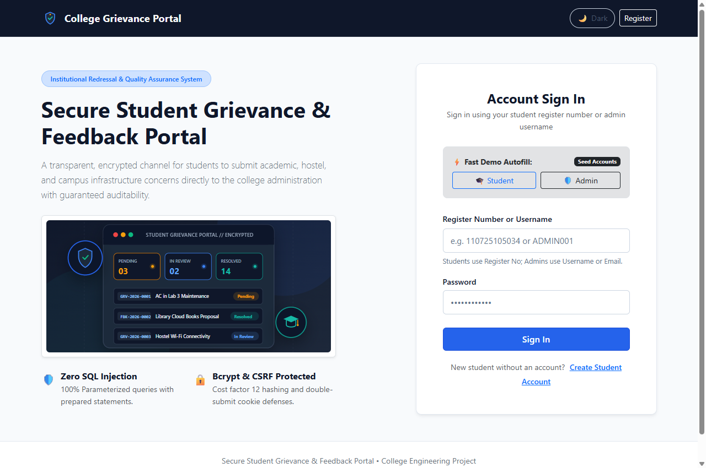
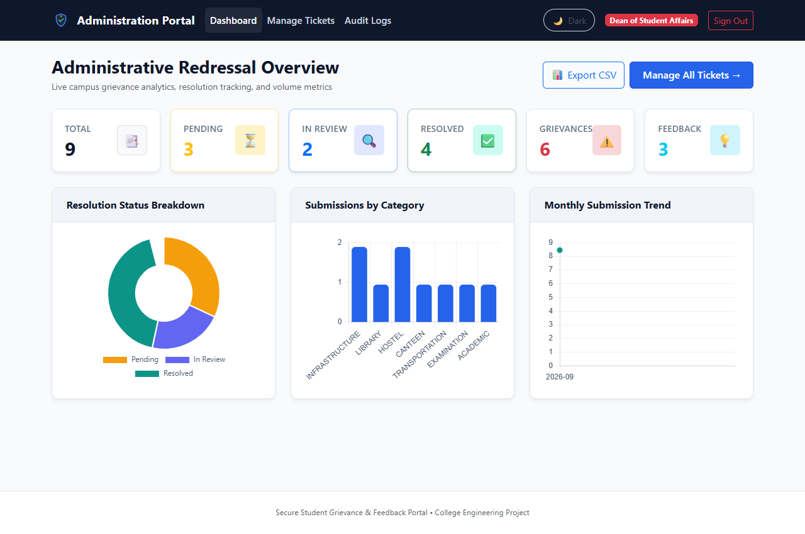
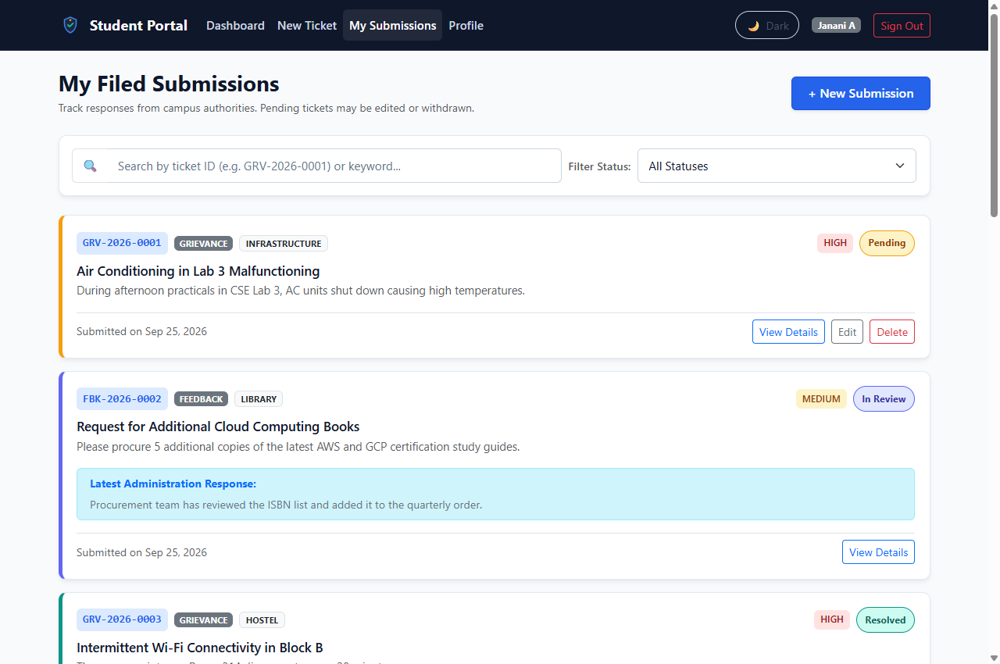
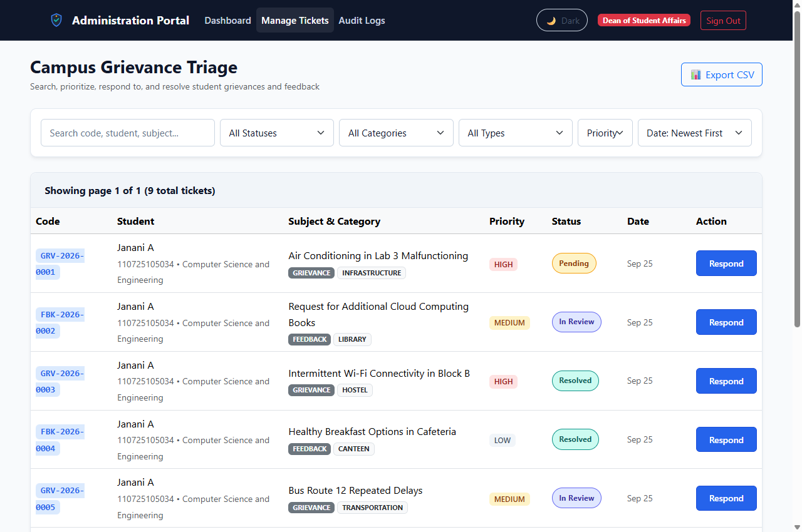
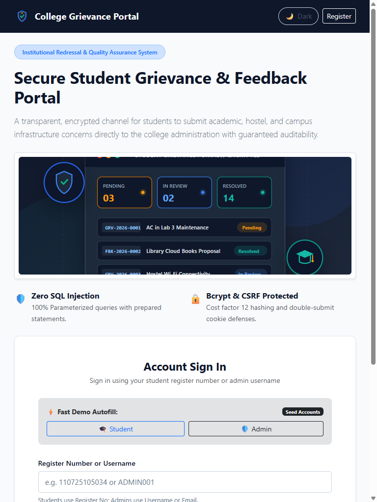
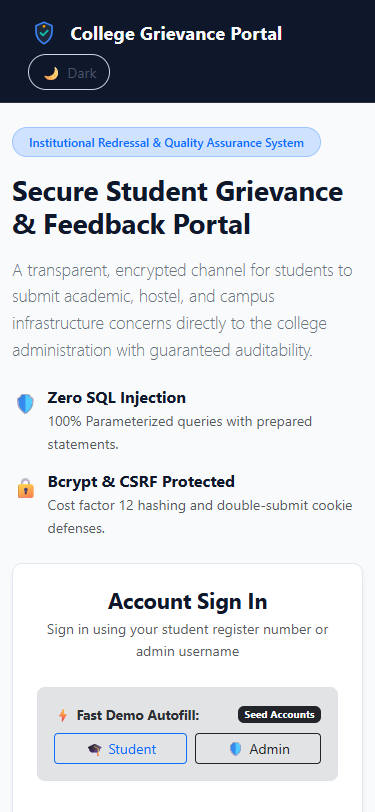
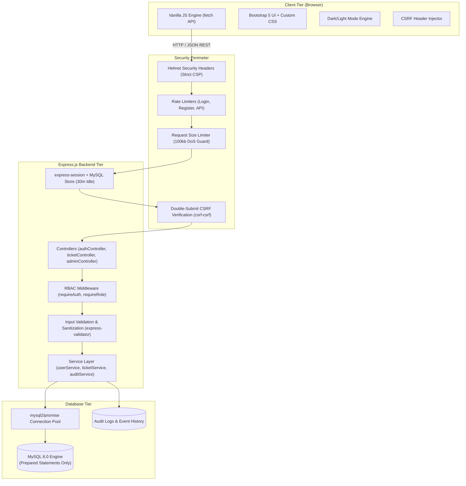
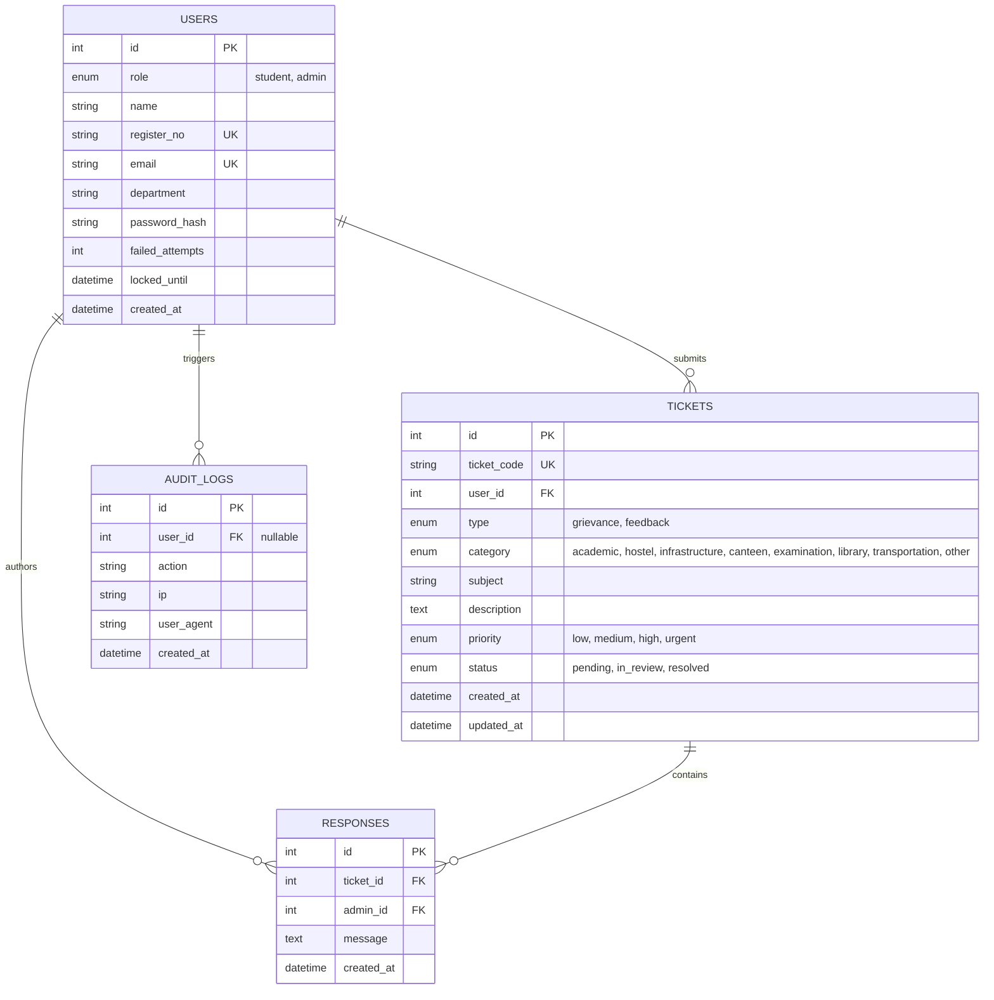

# Secure Student Grievance & Feedback Portal

[](LICENSE)
[](https://nodejs.org/)
[](https://expressjs.com/)
[](https://www.mysql.com/)
[](#security-architecture--controls)
[](#automated-testing)

A complete, production-grade, secure full-stack web application designed for collegiate institutions to handle student grievances and suggestions transparently. Built with **Node.js, Express.js, MySQL 8, vanilla JavaScript, and Bootstrap 5**, the portal provides robust role-based access control, cryptographic password hashing, strict CSRF mitigation, brute-force defense, and immutable security audit trails.

---

## Table of Contents
1. [Overview & Highlights](#overview--highlights)
2. [Visual Previews](#visual-previews)
3. [Architecture & ER Diagrams](#architecture--er-diagrams)
4. [Roles & Features](#roles--features)
5. [Tech Stack](#tech-stack)
6. [Security Architecture & Controls](#security-architecture--controls)
7. [Prerequisites](#prerequisites)
8. [Local Installation & Setup](#local-installation--setup)
   - [Option A: One-Command Docker Setup (Recommended)](#option-a-one-command-docker-setup-recommended)
   - [Option B: Local / Manual MySQL Setup](#option-b-local--manual-mysql-setup)
   - [Option C: Zero-Config In-Memory Mock Mode](#option-c-zero-config-in-memory-mock-mode)
9. [Database Initialization & Seeding](#database-initialization--seeding)
10. [Automated Testing](#automated-testing)
11. [REST API Documentation](#rest-api-documentation)
12. [Demo Credentials](#demo-credentials)
13. [Known Limitations & Future Scope](#known-limitations--future-scope)

---

## Overview & Highlights

Colleges and universities require a dependable, secure, and authenticated channel for students to voice concerns (ranging from hostel maintenance to academic schedule clashes) without fear of tampering or identity interception.

The **Secure Student Grievance & Feedback Portal** replaces vulnerable prototypes and paper submissions with a hardened web service featuring:
- **Calm, Institutional Aesthetic**: Deep navy (`#0f172a`), slate blue (`#2563eb`), amber (`#f59e0b` for Pending), and teal (`#0d9488` for Resolved) with full dark and light mode adaptation.
- **Client-Side Vanilla JS + Bootstrap 5**: Served as static assets; communicates strictly with Express through a JSON REST API using modern `fetch()`.
- **Zero-Trust Input & Defense-in-Depth**: Strict parameterization across all SQL queries, Double-Submit Cookie CSRF defenses, Bcrypt cost 12 hashing, automated account lockout on brute-force attempts, and zero-`innerHTML` data rendering to prevent XSS.

---

## Visual Previews

### Desktop & Dashboard Views
| Landing Page & Sign In | Admin Analytics Dashboard |
|:---:|:---:|
|  |  |

| Student "My Submissions" | Admin Ticket Triage & Resolution |
|:---:|:---:|
|  |  |

### Responsive Form Factors (Tablet 768px & Mobile 375px)
| Tablet View (768px) | Mobile View (375px) |
|:---:|:---:|
|  |  |

---

## Architecture & ER Diagrams

### High-Level System Architecture



### Database Entity-Relationship Diagram



---

## Roles & Features

### 1. Student Module
- **Self-Service Registration**: Validated student registration capturing name, register number, department, college email, and strong password.
- **Real-Time Password Complexity Feedback**: Live visual indicators verifying minimum 8 characters, uppercase, lowercase, and numeric digits.
- **Grievance & Feedback Submission**: Categorized submissions with priority levels (`Low`, `Medium`, `High`, `Urgent`).
- **Ticket Tracking & History**: "My submissions" dashboard showcasing unique ticket codes (`GRV-2026-0001`, `FBK-2026-0002`), color-coded status badges, and official administration responses.
- **Strict Pending-State Editing & Withdrawal**: Students can only edit or delete their submissions while the status remains `Pending`. Once marked `In Review` or `Resolved`, modifications are locked.
- **Profile & Credential Management**: View student enrollment details and securely update account password.

### 2. Administrator Module
- **Dedicated Administrative Access**: Admin accounts can never be created via public registration; they are seeded via secure administrative scripts.
- **Interactive Analytics Dashboard**: Real-time summary metric cards paired with dynamic Chart.js visualizations:
  1. *Status Distribution* (Doughnut chart)
  2. *Category Distribution* (Bar chart)
  3. *Monthly Submission Trends* (Line chart)
- **Comprehensive Ticket Triage**: Multi-parameter search, status/category/type/priority filters, column sorting, and server-side pagination.
- **Official Responses & Status Progression**: Administrative response drawer allowing status transitions (`Pending` &rarr; `In Review` &rarr; `Resolved`) while appending official resolution notes with timestamp and responder identity.
- **Secured CSV Export**: Downloadable report of tickets with built-in spreadsheet formula injection (`=`, `+`, `-`, `@`) neutralization.
- **Security Audit Logs**: Chronological log of successful logins, failed attempts, account lockouts, status updates, and exports.

### 3. Shared Experience
- Responsive layouts tailored for mobile (375px), tablet (768px), and desktop (1280px+).
- High-contrast focus states (`:focus-visible`) and WCAG-compliant form labels.
- Persistent Dark / Light mode toggle respecting user preferences.
- Accessible toast notification system using polite live regions (`aria-live="polite"`).
- Friendly branded HTTP error pages (`401.html`, `403.html`, `404.html`).

---

## Tech Stack

| Layer | Technologies & Dependencies | Purpose |
|---|---|---|
| **Runtime & Server** | Node.js (LTS), Express.js | High-performance asynchronous backend and static server |
| **Database** | MySQL 8.0, `mysql2/promise` | Relational storage with connection pooling & prepared statements |
| **Session Store** | `express-session`, `express-mysql-session` | Persistent server-side session management |
| **Frontend UI** | HTML5, CSS3, Vanilla JS, Bootstrap 5 (CDN), Chart.js (CDN) | Semantic, accessible, framework-free client interface |
| **Security** | `bcrypt`, `helmet`, `express-rate-limit`, `express-validator`, `csrf-csrf` | Comprehensive defense against OWASP Top 10 vulnerabilities |
| **Testing** | Jest, Supertest | Automated unit, integration, and security regression testing |

---

## Security Architecture & Controls

Every security protection requested has been implemented in dedicated application layers:

| Security Vector | Implementation Mechanism | Exact Code Location |
|---|---|---|
| **SQL Injection (SQLi)** | 100% Parameterized queries with prepared statements via `mysql2/promise`. Input is never concatenated into SQL strings. | [`src/services/userService.js`](src/services/userService.js), [`src/services/ticketService.js`](src/services/ticketService.js), [`src/services/auditService.js`](src/services/auditService.js) |
| **Password Hashing** | Bcrypt with cost factor 12. Password policy strictly enforced: minimum 8 characters, at least 1 uppercase, 1 lowercase, 1 number. | [`src/services/userService.js`](src/services/userService.js#L18), [`src/middleware/validate.js`](src/middleware/validate.js#L26) |
| **Session Security** | `express-session` stored in MySQL with `httpOnly: true`, `sameSite: 'strict'`, 30-minute idle expiration (`rolling: true`). Session ID is regenerated upon login (`req.session.regenerate()`) to neutralize Session Fixation. Complete session destruction on logout. | [`src/config/session.js`](src/config/session.js), [`src/controllers/authController.js`](src/controllers/authController.js#L145) |
| **Brute-Force & Lockout** | Account lockout for 5 minutes after 5 consecutive failed login attempts. Returns generic, timing-safe error messages ("Invalid register number or password") to prevent user enumeration. | [`src/services/userService.js`](src/services/userService.js#L95), [`src/controllers/authController.js`](src/controllers/authController.js#L90) |
| **Rate Limiting** | Strict IP-based rate limiting on sensitive routes: 10 attempts per 15 minutes for `/login`, 10 per hour for `/register`, 300 per 15 minutes for general API calls. | [`src/middleware/rateLimit.js`](src/middleware/rateLimit.js) |
| **Cross-Site Scripting (XSS)** | Server-side validation and sanitization via `express-validator`. Strict Content Security Policy (CSP) via `helmet`. Frontend zero-`innerHTML` policy for user content (using `textContent` and `escapeHtml()`). | [`server.js`](server.js#L29), [`src/middleware/validate.js`](src/middleware/validate.js), [`public/js/api.js`](public/js/api.js#L84) |
| **CSRF Defense** | Maintained Double-Submit Cookie CSRF protection via `csrf-csrf`. Tokens verified on all mutating routes (`POST`, `PUT`, `DELETE`). | [`src/middleware/csrf.js`](src/middleware/csrf.js), [`public/js/api.js`](public/js/api.js#L35) |
| **IDOR & Authorization** | Server-side ownership verification (`user_id === session.user.id`). Students cannot view, edit, or delete another student's tickets regardless of URL manipulation. | [`src/services/ticketService.js`](src/services/ticketService.js#L125), [`src/middleware/auth.js`](src/middleware/auth.js) |
| **Formula Injection (CSV)** | Neutralizes spreadsheet execution vulnerabilities (`=`, `+`, `-`, `@`) by prefixing dangerous cells with single quotes. | [`src/utils/csv.js`](src/utils/csv.js) |
| **Centralized Errors** | Production-safe error handler logs stack traces privately while returning clean JSON error objects to clients with zero internal leaks. | [`src/middleware/errorHandler.js`](src/middleware/errorHandler.js) |

---

## Prerequisites

- **Node.js**: v20.x or higher (LTS recommended)
- **npm**: v9.x or higher
- **Database (Pick One)**:
  - Docker Desktop (for one-command containerized MySQL 8), OR
  - Locally installed MySQL 8 (via XAMPP, WAMP, Homebrew, or standalone installer), OR
  - Zero-dependency built-in mock mode (`USE_MOCK_DB=true`)

---

## Local Installation & Setup

### 1. Clone & Install Dependencies

```bash
# Clone the repository
git clone https://github.com/your-username/secure-student-grievance-portal.git
cd secure-student-grievance-portal

# Install all npm dependencies
npm install
```

### 2. Configure Environment Variables

Copy the example environment configuration:

```bash
# Windows PowerShell
Copy-Item .env.example .env

# macOS / Linux
cp .env.example .env
```

Review `.env` settings:
```ini
PORT=3000
NODE_ENV=development

# MySQL Database
DB_HOST=127.0.0.1
DB_PORT=3306
DB_USER=grievance_user
DB_PASSWORD=grievance_password
DB_NAME=grievance_portal
DB_CONNECTION_LIMIT=10

# Mode: Set to 'false' for MySQL, or 'true' for instant zero-dependency mock mode
USE_MOCK_DB=false

# Secrets (Change in production!)
SESSION_SECRET=c0ll3ge_s3cur3_st0r3_s3ss10n_k3y_pr0t3ct10n_v1
CSRF_SECRET=csrf_pr0t3ct10n_s1gn1ng_s3cr3t_k3y_987654321
COOKIE_SECURE=false

# Account Security
MAX_LOGIN_ATTEMPTS=5
LOCK_TIME_MINUTES=5
SESSION_IDLE_TIMEOUT_MINUTES=30
```

---

### Option A: One-Command Docker Setup (Recommended)

1. Start the MySQL 8 container in the background:
   ```bash
   docker compose up -d
   ```
   *(This starts MySQL 8 on port 3306 and automatically runs `database/schema.sql` on first boot).*

2. Seed demo accounts and sample tickets:
   ```bash
   npm run seed
   ```

3. Start the application:
   ```bash
   npm start
   ```

4. Open your browser at:
   ```
   http://localhost:3000
   ```

---

### Option B: Local / Manual MySQL Setup

1. Start your local MySQL service (e.g. start MySQL via XAMPP Control Panel or `net start MySQL80`).
2. Verify credentials in your `.env` match your local MySQL configuration (e.g., `DB_USER=root`, `DB_PASSWORD=`).
3. Initialize the database schema:
   ```bash
   npm run db:init
   ```
4. Seed the demo records:
   ```bash
   npm run seed
   ```
5. Launch the application:
   ```bash
   npm start
   ```

---

### Option C: Zero-Config In-Memory Mock Mode

If you are grading or evaluating this project on a computer that does not currently have MySQL installed or running:
1. In `.env`, ensure:
   ```ini
   USE_MOCK_DB=true
   ```
2. Start the server:
   ```bash
   npm start
   ```
3. The server will boot instantly with pre-seeded demo accounts, 8 realistic tickets, and full in-memory responsiveness.

---

## Database Initialization & Seeding

The project provides two automated database scripts:

- **`npm run db:init`**: Connects to MySQL, parses [`database/schema.sql`](database/schema.sql), and creates the database, `users`, `tickets`, `responses`, `audit_logs`, and `sessions` tables along with all indexes and foreign keys.
- **`npm run seed`**: Populates the database with:
  - 1 System Administrator account (`Admin@123`)
  - 1 Demo Student account (`Student@123`)
  - 8 realistic tickets spanning `pending`, `in_review`, and `resolved` statuses across Academic, Hostel, Infrastructure, Canteen, Examination, Library, and Transportation categories.
  - Multi-entry admin resolution notes and security audit entries.

---

## Automated Testing

The project includes an automated test suite utilizing **Jest** and **Supertest** to test all security vectors and workflows:

```bash
npm test
```

### Test Coverage Highlights:
- **`tests/auth.test.js`**: Student registration field validation, password policy rejection, duplicate register number/email rejection, login success, 5-attempt brute-force lockout (5 minutes), unauthenticated 401 handling, and session destruction on logout.
- **`tests/tickets.test.js`**: Ticket creation with code generation (`GRV-2026-XXXX`), user submissions listing, editing pending tickets, blocking modification of resolved tickets, deleting pending tickets, and **IDOR cross-student access blocking**.
- **`tests/security.test.js`**: Role-based access control (blocking students from `/api/admin/*` with 403), CSRF rejection on missing or forged tokens, SQL injection payload safety (`' OR '1'='1`), XSS payload neutralization, and secured CSV export.
- **`tests/frontend.test.js`**: Static serving verification of all HTML pages, CSS tokens, SVG illustrations, and friendly error handlers.

---

## REST API Documentation

All state-changing endpoints (`POST`, `PUT`, `DELETE`) require an active session and a valid `x-csrf-token` header.

| Method | Endpoint | Access | Description |
|---|---|---|---|
| `GET` | `/api/auth/csrf-token` | Public | Retrieves CSRF double-submit token |
| `POST` | `/api/auth/register` | Public | Enrolls a new student account |
| `POST` | `/api/auth/login` | Public | Authenticates credentials; regenerates session |
| `POST` | `/api/auth/logout` | Authenticated | Destroys session; clears cookies |
| `GET` | `/api/auth/me` | Authenticated | Retrieves current authenticated profile |
| `POST` | `/api/auth/change-password` | Authenticated | Updates account password |
| `GET` | `/api/tickets` | Student | Lists current student's submitted tickets |
| `POST` | `/api/tickets` | Student | Submits new grievance or feedback |
| `GET` | `/api/tickets/:id` | Authenticated | Fetches ticket details (ownership validated) |
| `PUT` | `/api/tickets/:id` | Student | Edits ticket (only if `pending` and owned) |
| `DELETE` | `/api/tickets/:id` | Student | Deletes ticket (only if `pending` and owned) |
| `GET` | `/api/admin/stats` | Admin | Aggregated metrics for cards and Chart.js |
| `GET` | `/api/admin/tickets` | Admin | Paginated, filtered, and sorted tickets registry |
| `PUT` | `/api/admin/tickets/:id/status` | Admin | Updates status and adds official resolution response |
| `GET` | `/api/admin/export` | Admin | Exports sanitized CSV file |
| `GET` | `/api/admin/audit-logs` | Admin | Retrieves security audit event records |

---

## Demo Credentials

The seed script creates the following pre-configured credentials:

| Role | Username / Identifier | Password | Access Level |
|---|---|---|---|
| **Student** | `110725105034` (or `student@college.edu`) | `Student@123` | Submit, edit/delete pending tickets, track resolutions, update profile |
| **Admin** | `ADMIN001` (or `admin@college.edu`) | `Admin@123` | Analytics dashboard, ticket triage, update statuses, respond, export CSV, audit logs |

> **Note**: Both credentials can be auto-filled directly from the sign-in screen by clicking the **Student** or **Admin** quick-fill buttons.

---

## Known Limitations & Future Scope

1. **Email / SMS Dispatch**: In this college prototype, notifications are displayed directly within the portal and toast banners. Integrating nodemailer or an institutional SMTP gateway for instant email alerts upon ticket resolution is a logical production enhancement.
2. **File & Image Attachments**: Currently, grievances support descriptive text. Secure object storage (e.g. S3 or Cloud Storage) with virus scanning could be added for photo proof of infrastructure damage.
3. **Multi-Tier Departmental Triage**: Future iterations can route academic grievances automatically to the Dean of Academics, and hostel issues directly to the Chief Warden.

---

## License

This project is licensed under the terms of the [MIT License](LICENSE).
