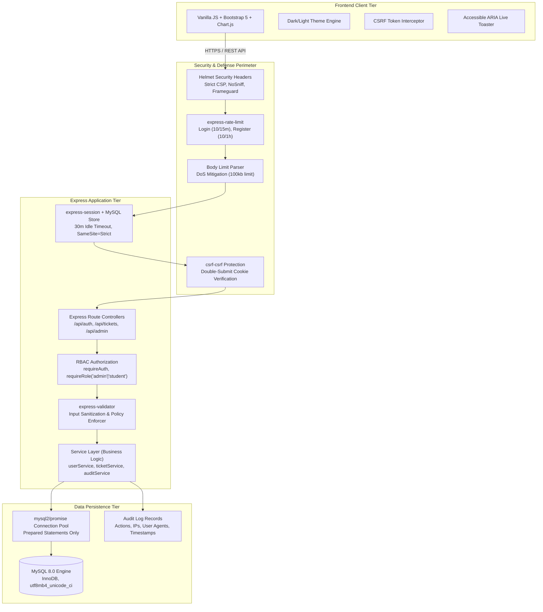

# System Architecture Documentation

## Secure Student Grievance & Feedback Portal

### 1. High-Level System Architecture

---

### 2. Request-Response Lifecycle & Security Filtering

1. **Edge Protection (Helmet)**:
   - Enforces a Content Security Policy (CSP) permitting only trusted scripts (Bootstrap and Chart.js CDNs) and disallowing unauthorized framing (`frame-ancestors 'none'`).
   - Adds HTTP Strict Transport Security (HSTS), X-Content-Type-Options: `nosniff`, and disables cross-site embedding.

2. **Traffic Throttling (Rate Limiting)**:
   - Sensitive auth routes (`/api/auth/login` and `/api/auth/register`) are guarded by dedicated IP limiters to prevent automated brute-forcing or credential stuffing.

3. **Session Identification & Verification**:
   - `express-session` reads the `sgp_session_id` cookie (`httpOnly: true`, `sameSite: 'strict'`).
   - Rolling expiration refreshes the 30-minute idle window upon active requests.

4. **CSRF Verification**:
   - Every mutation request (`POST`, `PUT`, `DELETE`, `PATCH`) must present a valid double-submit CSRF cookie (`sgp_csrf`) paired with the `x-csrf-token` HTTP header signed by the server's secret.

5. **Role-Based Authorization & Ownership Validation**:
   - `requireAuth` verifies active session existence.
   - `requireRole('admin')` restricts admin endpoints.
   - `ticketService` enforces row-level ownership: students can only access tickets matching `req.session.user.id`.

6. **Prepared Statement Execution**:
   - All SQL statements use placeholder parameters (`?`) via `mysql2/promise`. Input is never interpolated directly into queries.
