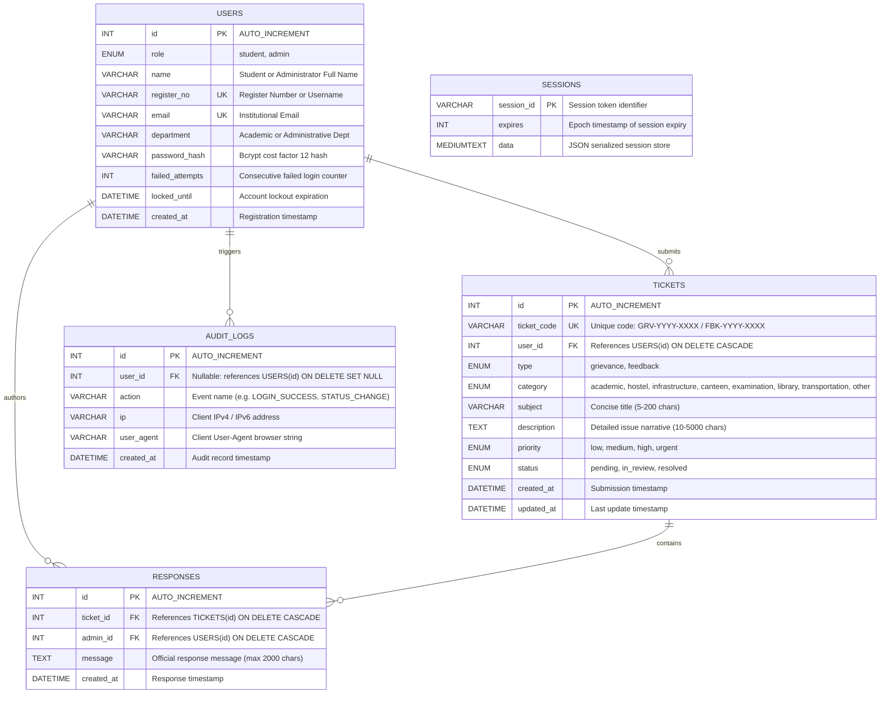

# Database Schema Specification

## Secure Student Grievance & Feedback Portal

### 1. Entity-Relationship Diagram

---

### 2. Table Definitions

#### `users`
| Column | Type | Nullable | Constraints / Index | Description |
|---|---|---|---|---|
| `id` | `INT` | No | `PRIMARY KEY`, `AUTO_INCREMENT` | Internal user ID |
| `role` | `ENUM('student','admin')` | No | Default: `'student'`, Indexed | Access control role |
| `name` | `VARCHAR(100)` | No | | Full name |
| `register_no` | `VARCHAR(50)` | No | `UNIQUE`, Indexed | Student registration number or admin username |
| `email` | `VARCHAR(150)` | No | `UNIQUE`, Indexed | Institutional email |
| `department` | `VARCHAR(100)` | No | | Department designation |
| `password_hash` | `VARCHAR(255)` | No | | Bcrypt cost factor 12 hash |
| `failed_attempts` | `INT` | No | Default: `0` | Consecutive failed login counter |
| `locked_until` | `DATETIME` | Yes | Default: `NULL` | Lockout expiration time (5 mins on 5 failures) |
| `created_at` | `DATETIME` | No | Default: `CURRENT_TIMESTAMP` | Account creation timestamp |

#### `tickets`
| Column | Type | Nullable | Constraints / Index | Description |
|---|---|---|---|---|
| `id` | `INT` | No | `PRIMARY KEY`, `AUTO_INCREMENT` | Internal ticket ID |
| `ticket_code` | `VARCHAR(50)` | No | `UNIQUE`, Indexed | Standardized code (`GRV-YYYY-XXXX`) |
| `user_id` | `INT` | No | `FOREIGN KEY` -> `users(id)` | Ticket creator |
| `type` | `ENUM('grievance','feedback')` | No | Default: `'grievance'` | Submission classification |
| `category` | `ENUM(...)` | No | Indexed | Campus department category |
| `subject` | `VARCHAR(200)` | No | | Subject title |
| `description` | `TEXT` | No | | Detailed problem narrative |
| `priority` | `ENUM('low','medium','high','urgent')` | No | Default: `'medium'` | Urgency level |
| `status` | `ENUM('pending','in_review','resolved')` | No | Default: `'pending'`, Indexed | Workflow status |
| `created_at` | `DATETIME` | No | Default: `CURRENT_TIMESTAMP`, Indexed | Creation timestamp |
| `updated_at` | `DATETIME` | No | `ON UPDATE CURRENT_TIMESTAMP` | Last modified timestamp |

#### `responses`
| Column | Type | Nullable | Constraints / Index | Description |
|---|---|---|---|---|
| `id` | `INT` | No | `PRIMARY KEY`, `AUTO_INCREMENT` | Response record ID |
| `ticket_id` | `INT` | No | `FOREIGN KEY` -> `tickets(id)` | Target ticket ID |
| `admin_id` | `INT` | No | `FOREIGN KEY` -> `users(id)` | Responding administrator |
| `message` | `TEXT` | No | | Resolution text |
| `created_at` | `DATETIME` | No | Default: `CURRENT_TIMESTAMP` | Response timestamp |

#### `audit_logs`
| Column | Type | Nullable | Constraints / Index | Description |
|---|---|---|---|---|
| `id` | `INT` | No | `PRIMARY KEY`, `AUTO_INCREMENT` | Audit log ID |
| `user_id` | `INT` | Yes | `FOREIGN KEY` -> `users(id)` | User trigger or null if unauthenticated |
| `action` | `VARCHAR(100)` | No | Indexed | Security action tag |
| `ip` | `VARCHAR(45)` | No | | Origin IP address |
| `user_agent` | `VARCHAR(255)` | Yes | | Client User-Agent |
| `created_at` | `DATETIME` | No | Default: `CURRENT_TIMESTAMP`, Indexed | Event timestamp |
